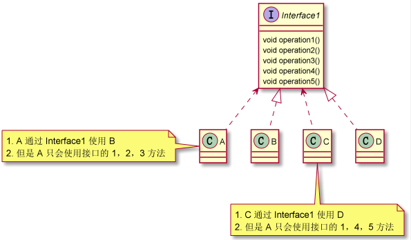
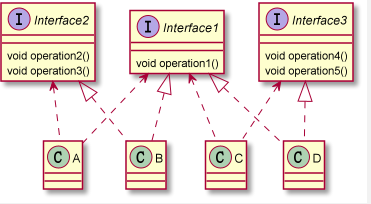

# 1、设计模式的七大原则

## 1.1、设计模式的目的

​	编写软件的过程中，程序员面临着来自**耦合性，内聚性以及可维护性，可扩展性，重用性，灵活性**等多方面的挑战，设计模式是为了让程序（软件）具有更好的：

1. 代码重用性（即：相同功能的代码，不用多次编写）
2. 可读性（即：编程规范性，便于其他程序员的阅读和理解）
3. 可扩展性（即：当需要增加新的功能时，非常的方便，成为可维护性）
4. 可靠性（即：当增加新的功能后，对原来的功能没有影响）
5. 使程序呈现高内聚，低耦合的特性

​	设计模式包含面向对象的精髓，“懂了设计模式，你就懂了面向对象分析和设计（OOA/D）的精要”。

​	Scott Mayers 在其巨著《Effective C++》就曾经说过：C++ 老手和 C++ 新手的区别就是前者手背上有很多伤疤。

## 1.2、设计模式的七大原则

​	设计模式的原则，其实就是程序员在编程时，应当遵守的原则，也是各种设计模式的基础（即：设计模式为什么这样设计的依据）。

​	设计模式常用的七大原则有：

1. 单一职责原则
2. 接口隔离原则
3. 依赖倒转（倒置）原则
4. 里氏替换原则
5. 开闭原则
6. 迪米特法则
7. 合成复用原则


# 2、单一职责原则

## 2.1、基本介绍

​	对类来说，即一个类应该只负责一项职责，如类 A 负责两个不同的职责：职责 1，职责 2。当职责 1 需求变更而改变 A 时，可能造成职责 2 执行错误，所以需要将类 A 的力度分解为 A1，A2。

## 2.2、应用案例

​	以交通工具为例：

```
com.moriaty.principle.singleresponsibility.SingleResponsibility1
com.moriaty.principle.singleresponsibility.SingleResponsibility2
com.moriaty.principle.singleresponsibility.SingleResponsibility3
```

## 2.3、注意事项和细节

1. 降低类的复杂度，一个类只负责一项职责。
2. 提高类的可读性，可维护性。
3. 降低变更带来的风险。
4. 通常情况下，我们应当遵守单一职责原则，只有逻辑足够简单，才可以在代码级违反单一职责原则；只有类中方法数量足够少，可以在方法级别保持单一职责原则。

# 3、接口隔离原则

## 3.1、基本介绍

​	客户端不应该依赖它不需要的接口，即一个类对另一个类的依赖应该建立在最小的接口上。

## 3.2、应用实例

​	类 A 通过接口 Interface1 依赖类 B，类 C 通过接口 Interface1 依赖类 D，如果接口 Interface1 对于类 A 和类 C 来说不是最小接口，那么类 B 和类 D 必须去实现他们不需要的方法。如下图：



​	代码实现：

```
com.moriaty.principle.segregation.Segregation1
```

## 3.3、进行改进	

​	使用接口隔离原则进行改进：

1. 类 A 通过接口 Interface1 依赖类 B，类 C 通过接口 Interface1 依赖类 D，如果接口 Interface1 对于类 A 和类 C 来说不是最小接口，那么类 B 和类 D 必须去实现他们不需要的方法。
2. 将接口 Interface1 拆分为独立的几个接口，类 A 和类 C 分别与他们需要的接口建立依赖关系。也就是采取接口隔离原则。
3. 接口 Interface1 中出现的方法，根据实际情况拆分为三个接口。



​	代码实现：

```
com.moriaty.principle.segregation.improve.Segregation1
```

# 4、依赖倒转（倒置）原则

## 4.1、基本介绍

​	依赖倒转原则（Dependence Inversion Principle）是指：

1. 高层模块不应该依赖底层模块，二者都应该依赖其抽象。
2. 抽象不应该依赖细节，细节应该依赖抽象。
3. 依赖倒转（倒置）的中心思想是面向接口编程。
4. 依赖倒转原则是基于这样的设计理念：相对于细节的多变性，抽象的东西要稳定的多。以抽象为基础搭建的架构比以细节为基础的架构要稳定的多。在 JAVA 中，抽象指的是接口或抽象类，细节就是具体的实现类。
5. 使用接口或抽象类的目的是制定好规范，而不设计任何具体的操作，把展现细节的任务交给他们的实现类去完成。

## 4.2、应用实例

​	以 Person 接收消息为例：

```
com.moriaty.principle.inversion.DependencyInversion
com.moriaty.principle.inversion.improve.DependencyInversion
```

## 4.3、依赖关系传递的三种方式

1. 接口传递
2. 构造方法传递
3. setter 方式传递

​	代码如下：

```
com.moriaty.principle.inversion.DependencyPass
```

## 4.4、依赖倒转原则的注意事项和细节

1. 底层模块尽量都要有抽象类和接口，或者两者都有，程序稳定性更好。
2. 变量的声明类型尽量是抽象类或者接口，这样我们的变量引用和实际对象之间，就存在一个缓冲层，利于程序扩展和优化。
3. 继承时遵循里氏替换原则。