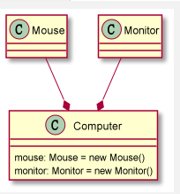

# 一、UML

## 1.1、基本介绍

1. UML（Unified modeling language）统一建模语言，是一种用于软件系统分析和设计的语言工具，他用于帮助软件开发人员进行思考和记录思路的结果
2. UML 本身是一套符号的规定，就像数学符号和化学符合一样，这些符号用于描述软件模型中的各个元素和他们之间的关系，比如类、接口、实现、泛化、依赖、组合、聚合等
3. 使用 UML 来建模，常用的工具有 Rational Rose，也可以用一些插件和建模


## 1.2、UML 图类型

​		UML 图有以下几种：

1. 用例图
2. 静态结构图：==**类图**==、对象图、包图、组件图、部署图
3. 动态行为图：交互图（时序图和协作图）、状态图、活动


# 二、UML 类图

## 2.1、介绍

1. 用于描述系统中的类（对象）本身的组成和类（对象）之间的各种静态关系
2. 类之间的关系：**依赖、泛化（继承）、实现、关联、聚合、组合**

## 2.2、类图语法

| 语法           | 说明                   | 使用方法                  |
| -------------- | ---------------------- | ------------------------- |
| note           | 注释                   | note right/left of XX: YY |
| class          | 类，可以添加属性和方法 | class X {}                |
| interface      | 接口                   | interface X{}             |
| Dependency     | 依赖（使用） --->      | X ..> Y                   |
| Association    | 关联 -                 | X - Y                     |
| Generalization | 泛化（继承）-△         | X --\|> Y                 |
| Realization    | 实现 --△               | X ..\|> Y                 |
| Aggregation    | 聚合（弱依赖） -◇      | X --o Y                   |
| Composite      | 组合（强依赖） -◆      | X --* Y                   |

​	使用示例：

```java
com.moriaty.uml.Person;
```


## 2.3、依赖关系（Dependence）

​	只要是在**类中用到了对方**，那么他们之间就存在依赖关系。如果没有对象，连编译都过不了。

​	依赖的几种类型：

1. 类中使用了对方
2. 类的成员属性
3. 方法的返回类型
4. 方法接受的参数类型
5. 方法中使用到


​	使用示例：

```java
com.moriaty.uml.dependence.Department;
com.moriaty.uml.dependence.IdCard;
com.moriaty.uml.dependence.Person;
com.moriaty.uml.dependence.PersonDao;
com.moriaty.uml.dependence.PersonServiceBean;
```


## 2.4、泛化关系（Generalization）

​	泛化关系实际上就是继承关系，他是依赖关系的特例。

1. 泛化关系实际上就是继承关系
2. 如果 A 类继承了 B 类，我们就说 A 和 B 存在泛化关系


​	使用示例：

```java
com.moriaty.uml.generalization.DaoSupport;
com.moriaty.uml.generalization.PersonServiceBean;
```


## 2.5、实现关系（Realization）

​	实现关系实际上就是 A 类实现 B 类，他是依赖关系的特例。

​	使用示例：

```java
com.moriaty.uml.realization.PersonService;
com.moriaty.uml.realization.PersonServiceBean;
```


## 2.6、关联关系（Association）

​	关联关系实际上就是**类与类之间的联系**，他是**依赖关系的特例**。

​	关联关系具有==**导航性**==：即双向关系或单向关系。

​	关系具有多重性：如“1”（表示有且仅有一个），“0...”（表示 0 个或多个），

“0, 1”（表示 0 个或者一个），“n...m”（表示 n 到 m 个都可以），“m...”（表示至少 m 个）

​	使用示例：


## 2.7、聚合关系（Aggregation）

​	聚合关系表示的是整体和部分的关系，**整体与部分可以分开**。==**聚合关系是关联关系的特例**==，所以他具有关联关系的导航性与多重性。

​	使用示例：

```java
com.moriaty.uml.aggregation.Mouse;
com.moriaty.uml.aggregation.Monitor;
com.moriaty.uml.aggregation.Computer;
```


## 2.8、组合关系（Composite）

​	如果我们认为整体和部分是**不可分离**的，那么就是组合关系。

​	使用示例1：

```java
com.moriaty.uml.composite.Mouse;
com.moriaty.uml.composite.Monitor;
com.moriaty.uml.composite.Computer;
```



​	使用示例2：

```java
com.moriaty.uml.composite.Head;
com.moriaty.uml.composite.IdCard;
com.moriaty.uml.composite.Person;
```


​	如果在程序中定义了**级联删除**，那么同样为组合关系。