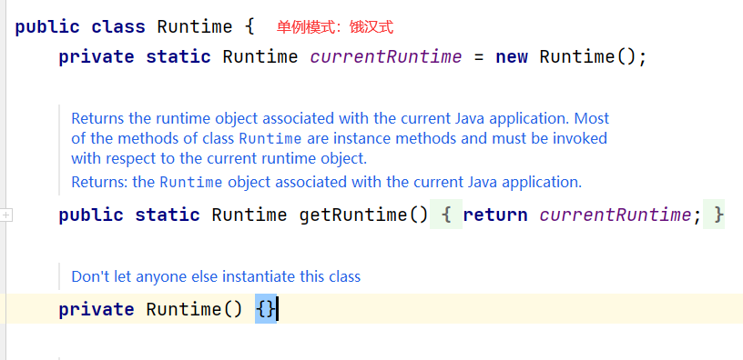
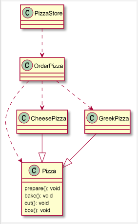
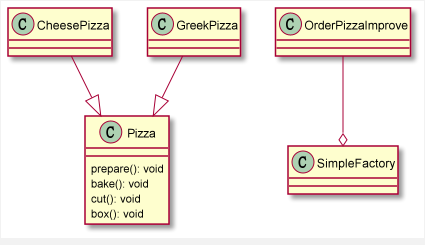
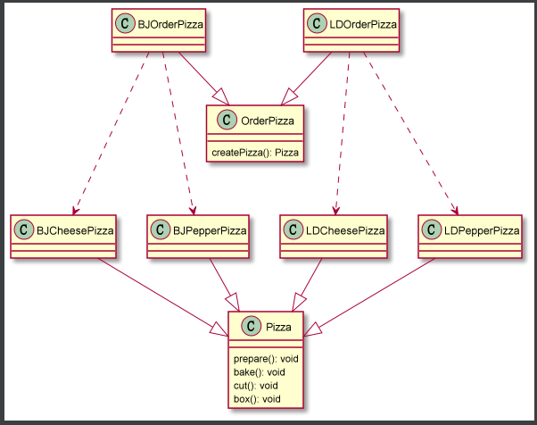
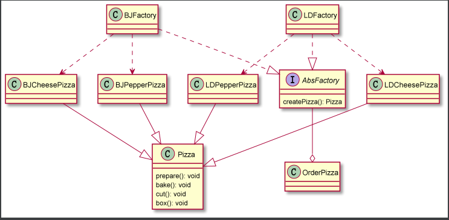

# 一、设计模式

## 1.1、简介

1. 设计模式是程序员在面对同类软件工厂设计问题所总结出来的有用的经验，模式不是代码，而是某类问题的通用解决方案，设计模式（Design pattern）代表了最佳的实践。这些解决方法是众多软件开发人员经过相当长的一段时间的实验和错误总结出来的。
2. 设计模式的本质是提供软件的维护性，通用性和扩展性，并降低软件的复杂度。

## 1.2、设计模式类型

​	设计模式分为三种类型，共 23 种

1. **创建型模式**：单例模式、抽象工厂模式、原型模式、建造者模式、工厂模式
2. **结构型模式**：适配器模式、桥接模式、装饰模式、组合模式、外观模式、享元模式、代理模式
3. **行为型模式**：模板方法模式、命令模式、访问者模式、迭代器模式、观察者模式、中介者模式、备忘录模式、解释器模式、状态模式、策略模式、职责链模式（责任链模式）

# 二、单例模式

## 2.1、介绍

​	所谓类的单例设计模式，就是采取一定的方法保证在整个的软件系统中，对某个类==**只能存在一个对象示例**==，并且该类只提供一个取得其对象实例的方法（静态方法）。

## 2.2、单例模式的八种方式

1. ==**饿汉式（静态常量）**==
2. ==**饿汉式（静态代码块）**==
3. 懒汉式（线程不安全）
4. 懒汉式（线程安全，同步方法）
5. 懒汉式（线程安全，同步代码块）
6. ==**双重检查**==
7. ==**静态内部类**==
8. ==**枚举**==

## 2.3、==饿汉式（静态常量）==

### 2.3.1、实现

1. 构造器私有化
2. 类的内部创建对象
3. 向外暴露一个静态的公共方法：getInstance

```java
/**
 * 饿汉式（静态变量）
 */
class Singleton {
    // 1. 私有化构造器
    private Singleton() {

    }

    // 2. 本类内部创建对象实例
    private final static Singleton instance = new Singleton();

    // 3. 提供一个公有的静态方法，返回实例对象
    public static Singleton getInstance() {
        return instance;
    }
}
```

### 2.3.2、优缺点

1. 优点：这种写法比较简单，就是在类装载的时候就完成了实例化。避免了线程同步问题。
2. 缺点：在类装载的时候就完成了实例化，没有达到 Lazy Loading 的效果。如果从始至终从未使用过这个实例，则会造成内存的浪费。
3. 这种方式基于 ClassLoader 机制避免了多线程的同步问题。不过，instance 在类装载时就实例化，在单例模式中大多数都是调用 getInstance 方法，但是导致类装载的原因有很多种，因此不能确定有其他的方式（或者其他的静态方法）导致类装载，这时候初始化 instance 就没有达到 Lazy Loading 的效果。
4. 结论：这种单例模式可用，可能造成内存浪费。

## 2.4、==饿汉式（静态代码块）==

### 2.4.1、实现

```java
/**
 * 饿汉式（静态代码块）
 */
class Singleton {
    // 1. 私有化构造器
    private Singleton() {

    }

    static {
        // 2. 在静态代码块中创建单例对象
        instance = new Singleton();
    }

    private static Singleton instance;

    // 3. 提供一个公有的静态方法，返回实例对象
    public static Singleton getInstance() {
        return instance;
    }
}
```

### 2.4.2、优缺点

1. 这种方式与上面的方式其实类似，只不过将类的实例化的过程放在了静态代码块中，也是在类装载的时候，就执行静态代码块的代码，初始化类的实例。优缺点和上面是一样的。
2. 结论：这种单例模式可用，但是可能在成内存浪费。

## 2.5、懒汉式（线程不安全）

### 2.5.1、实现

```java
/**
 * 懒汉式（线程不安全）
 */
class Singleton {
    private static Singleton instance;

    private Singleton() {

    }

    // 提供一个静态的公有方法，当使用该方法时，才会创建 instance
    public static Singleton getInstance() {
        if (instance == null) {
            instance = new Singleton();
        }
        return instance;
    }

}
```

### 2.5.2、优缺点

1. 起到了 Lazy Loading 的效果，但是只能在单线程下使用。
2. 如果在多线程下，一个线程进入了 `if (instance == null)` 判断语句块，还未来得及往下执行，另一个线程也通过了这个判断语句，这时变会产生多个实例，所以在多线程环境下不可以使用。
3. 结论：在实际开发中，不可以使用。

## 2.6、懒汉式（线程安全，同步方法）

### 2.6.1、实现

```java
/**
 * 懒汉式（线程安全，同步方法）
 */
class Singleton {
    private static Singleton instance;

    private Singleton() {

    }

    // 提供一个静态的公有方法，加入了同步处理的代码，解决了线程安全问题
    public static synchronized Singleton getInstance() {
        if (instance == null) {
            instance = new Singleton();
        }
        return instance;
    }

}
```

### 2.6.2、优缺点

1. 解决了线程不安全问题
2. 效率太低，每个线程在想获得类的实例的时候，执行 `getInstance()` 方法都要进行同步。而这个方法只执行一次实例化代码就够了，后面的想获得该类实例，直接 return 即可。方法进行同步效率太低。
3. 结论：在实际开发中，不推荐使用这种方式。

## 2.7、懒汉式（线程安全，同步代码块）

### 2.7.1、实现

```java
/**
 * 懒汉式（线程安全，同步代码块）
 */
class Singleton {
    private static Singleton instance;

    private Singleton() {

    }

    public static Singleton getInstance() {
        if (instance == null) {
            // 在此处加同步，无法解决线程安全问题
            synchronized(Singleton.class){
                instance = new Singleton();
            }
        }
        return instance;
    }

}
```

### 2.7.2、优缺点

1. 这种方式，本意是想对第四种实现方式的改进，因为前面同步方法效率太低，改为同步产生实例化的代码块。
2. ==**但是这种同步并不能起到线程同步的作用**==。跟第三种实现方式遇到的情形一致，假如一个线程进入了 `if (instance == null)` 判断语句，还未来得及往下执行，另一个线程也通过了这个判断语句，这时便会产生多个实例。
3. 结论：在实际开发中，不能使用这种方式。

## 2.8、==双重检查==

### 2.8.1、实现

```java
class Singleton {
    private Singleton() {

    }

    private static volatile Singleton instance;

    // 双重 instance == null 判断
    public static Singleton getInstance() {
        if (instance == null) {
            synchronized (Singleton.class) {
                if (instance == null) {
                    instance = new Singleton();
                }
            }
        }
        return instance;
    }
}
```

### 2.8.2、优缺点

1. Double-Check 概念是多线程开发中常使用到的，如代码中所示，我们进行了两次 `if (instance == null)` 检查，这样就可以保证线程安全了。
2. 这样，实例化代码只用执行一次，后面再次访问时，判断 `if (instance == null)`，直接 return 实例化对象，也避免了反复进行方法同步。
3. 线程安全：延迟加载，效率较高。
4. 结论：在实际开发中，推荐使用这种单例设计模式。

## 2.9、==静态内部类==

### 2.9.1、实现

```java
/**
 * 静态内部类
 */
class Singleton {

    private Singleton() {

    }

    private static volatile Singleton instance;

    // 写一个静态内部类，不会在一开始就进行类装载
    private static class SingletonInstance {
        private static final Singleton INSTANCE = new Singleton();
    }

    public static Singleton getInstance() {
        return SingletonInstance.INSTANCE;
    }
}
```

### 2.9.2、优缺点

1. 这种方式采用了类装载的机制来保证初始化实例时只有一个线程。
2. 静态内部类方式在 Singleton 类被装载时并不会立即实例化，而是在需要实例化时，调用 getInstance() 方法，才会装载 SingleInstance 类，从而完成 Singleton 的实例化。
3. 类的静态属性只会在第一次加载类的时候初始化，所以在这里，JVM 帮助我们保证线程的安全性，在类进行初始化时，别的线程是无法进入的。
4. 优点：避免了**线程不安全**，利用静态内部类特点实现延迟加载，效率高。
5. 结论：推荐使用。

## 2.10、==枚举==

### 2.10.1、实现

```java
/**
 * 枚举
 */
enum Singleton {
    INSTANCE;
    public void sayOk(){
        System.out.println("ok");
    }
}
```

### 2.10.2、优缺点

1. 这借助 JDK 1.5 中添加到枚举来实现单例模式。不仅能避免多线程同步问题，而且还能防止反序列化重新创建新的对象。
2. 这种方式是 Effective Java 作者推荐的方式。
3. 结论：推荐使用。

## 2.11、单例模式在 JDK 中的应用

​	`java.lang.Runtime` 就是经典的单例模式。



## 2.12、单例模式注意事项和细节说明

1. 单例模式保证了系统内存中该类只存在一个对象，节省了系统资源，对于一些需要频繁创建销毁的对象，使用单例模式可以提高系统性能。
2. 当想实例化一个单例类的时候，必须要记住使用相应的获取对象的方法，而不是使用 new。
3. 单例模式使用的场景：需要频繁的进行创建和销毁的对象，创建对象时耗时过多或耗费资源过多（即：重量级对象），但又经常用到的对象、工具类对象、频繁访问数据库或文件的对象（比如数据源、session 工厂等）。

# 三、简单工厂模式

## 3.1、从需求出发

​	有一个披萨的项目，需求如下：

1. 披萨的种类很多（比如 GreekPizz、CheesePizz 等）
2. 披萨制作有 prepare、bake、cut、box
3. 完成披萨订购功能

## 3.2、传统的解决方法



```java
com.moriaty.factory.simplefactory.pizzastore.pizza.Pizza;
com.moriaty.factory.simplefactory.pizzastore.pizza.GreekPizza;
com.moriaty.factory.simplefactory.pizzastore.pizza.CheesePizza;
com.moriaty.factory.simplefactory.pizzastore.order.OrderPizza;
com.moriaty.factory.simplefactory.pizzastore.order.PizzaStore;
```

## 3.3、传统方法的优缺点

1. 优点是比较好理解，简单易操作。
2. 缺点是违反了设计模式的 ocp 原则，即对==**扩展开放，对修改关闭**==。即当我们给类增加新功能的时，尽量不修改代码，或者尽可能少修改代码。

## 3.4、改进的思路

​	把创建 Pizza 对象封装到一个类中，这样我们有新的 Pizza 种类时，只需要修改该类即可，其他有创建到 Pizza 对象的代码就不需要修改了 -> 简单工厂模式。

## 3.5、简单工厂模式介绍

1. 简单工厂模式是属于创建型模式，是工厂模式的一种。==**简单工厂模式是由一个工厂对象决定创建出哪一种产品类的实例**==。简单工厂模式是工厂模式家族中最简单的模式。
2. 简单工厂模式：定义了一个创建对象的类，由这个类来**封装实例化对象的行为**。
3. 在软件开发中，当我们会用到大量的创建某种、某类或者某批对象时，就会使用到工厂模式。

## 3.6、简单工厂模式实现



```java
com.moriaty.factory.simplefactory.pizzastore.order.OrderPizzaImprove;
com.moriaty.factory.simplefactory.pizzastore.pizza.Pizza;
com.moriaty.factory.simplefactory.pizzastore.pizza.GreekPizza;
com.moriaty.factory.simplefactory.pizzastore.pizza.CheesePizza;
com.moriaty.factory.simplefactory.pizzastore.order.PizzaStore;
```

## 3.7、简单工厂模式补充

​	简单工厂模式也叫静态工厂模式，可以创建静态方法来实现相同的功能。

```java
 public static Pizza createPizza2(String type) {
        System.out.println("simple factory2: " + type);
        Pizza pizza = null;
        if ("greek".equals(type)) {
            pizza = new GreekPizza();
            pizza.setName("greek pizza");
        } else if ("cheese".equals(type)) {
            pizza = new CheesePizza();
            pizza.setName("cheese pizza");
        }
        return pizza;
    }
```

## 3.8、工厂方法模式

**工厂方法模式设计方案**：将披萨项目的实例化功能抽象成抽象方法，在不同的口味点餐子类中具体实现。

**工厂方法模式**：定义了一个创建对象的抽象方法，由子类决定要实例化的类。工厂方法模式将**对象的实例化推迟到子类**。



```
com.moriaty.factory.factorymethod.pizzastore.*
```

## 3.9、抽象工厂模式

1、抽象工厂模式：定义了一个 interface 用户创建相关或有依赖关系的对象簇，而无需指明具体的类。

2、抽象工厂模式可有将**简单工厂模式**和**工厂方法模式**进行整合。

3、从设计层面看，抽象工厂模式就是对简单工厂模式的改进。

4、将工厂抽象成两层，AbsFactory（抽象工厂）具体实现的工厂子类。程序员可以根据创建对象类型使用对应的工厂子类。这样将单个的简单工厂类变成了工厂簇。



```
```

